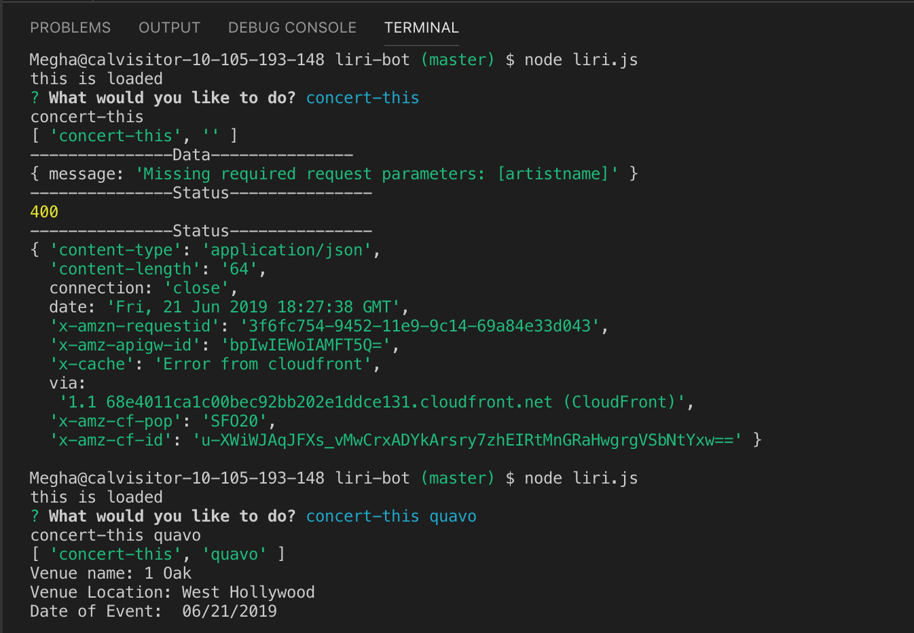

# Liri-bot: Siri for your concert, spotify, and movie searches!

## Built by: Megha Bindiganavale
This is a node application that allows user to look up information about concerts using artist name, songs on Spotify using song name, and movies using movie names! 

## Tech Used 
    * Node
    * Javascript
    * APIs
    * Moment.js

Instructions for Command line arguments:
1. open the application:

        node liri.js
2. Inquirer prompts "What would you like to do" 

    Input Options: 

        a. concert-this 'artist name'

        b. spotify-this-song 'song-name'

        c. movie-this 'movie-name'

Responses will look like this: 

    concert-this

    spotify-this-song 

    movie-this

